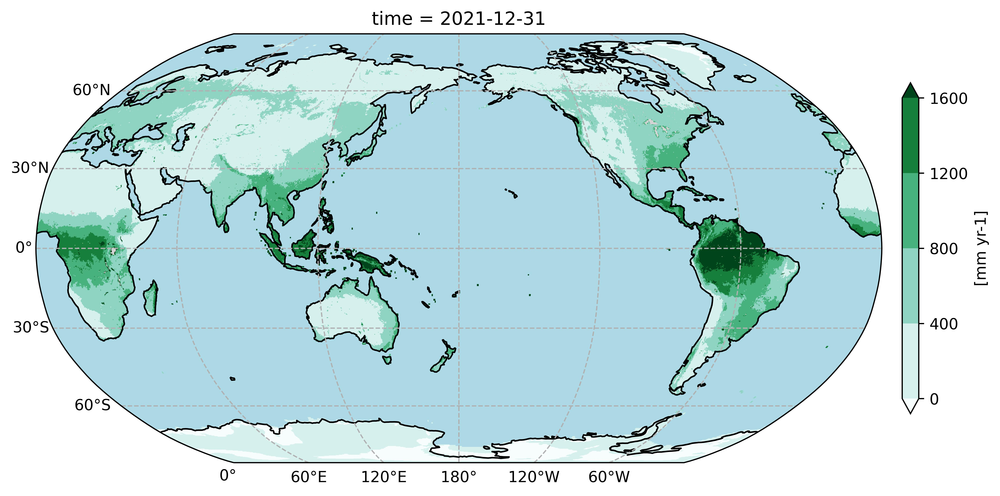

# 写在前面

本笔记使用**Rmarkdown**记录，参考文献见末尾。 [^index-1]

- [笔记仓库（github）](https://github.com/cug-xyx/Climate-Numerical-Simulation)
- [笔记创建方法（知乎）](https://zhuanlan.zhihu.com/p/631927101)

[^index-1]: [CUG-HydroMeteorology](https://cug-hydro.github.io/CUG-HydroMeteorology/index.html#pandoc)

## 代码尝试

```{r eval=TRUE, include=TRUE}
head(mtcars)
```

## 公式尝试

潜在蒸散发（Potential evapotranspiration，PET）公式：

$$
PET=
\frac{\Delta}{(\Delta+\gamma)}\frac{R_n}{\lambda}+
\frac{\gamma}{(\Delta+\gamma)}
\frac{6.43\times(1+0.536U_2)VPD}{\lambda} \tag{1}
$$
